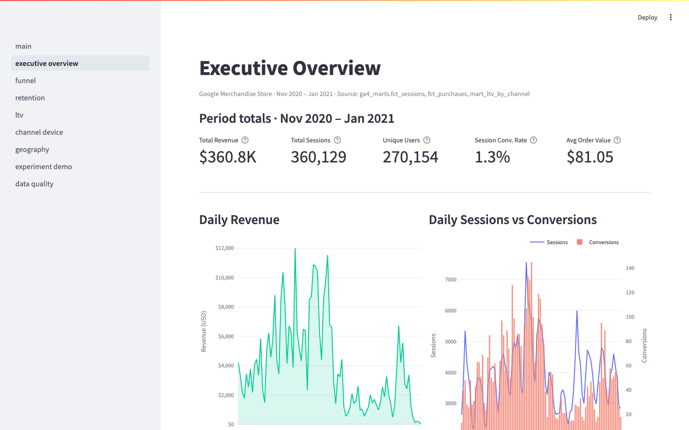
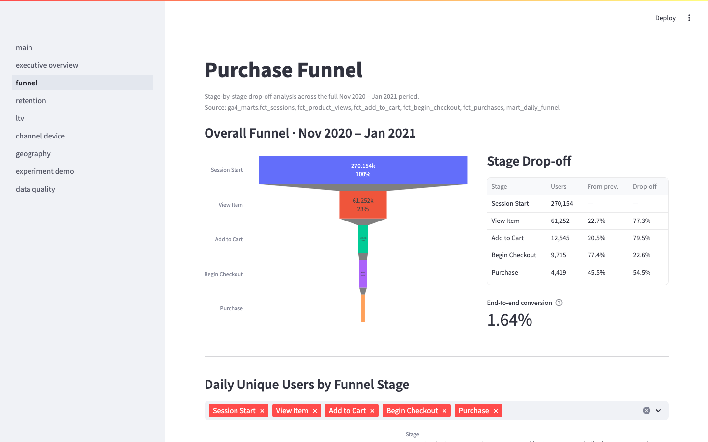
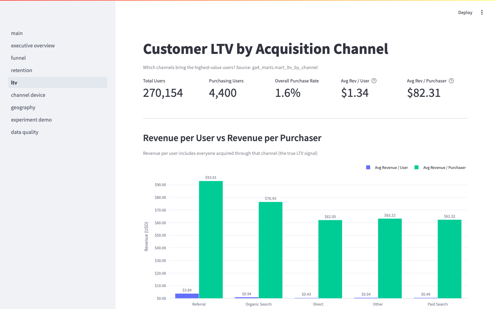
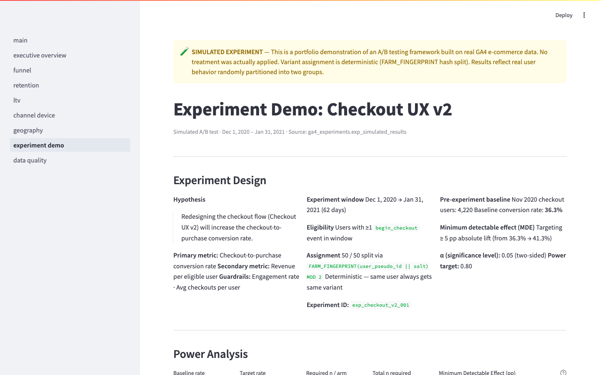

# Product Analytics & Experimentation Platform

> A production-grade analytics engineering portfolio built on Google's public GA4
> e-commerce dataset — covering the complete stack from raw event ingestion through
> funnel analysis, cohort retention, LTV modeling, and a simulated A/B testing
> framework with statistical significance testing.

**Stack:** BigQuery · dbt Core 1.8 · Python · Streamlit · Plotly · scipy

---

## Screenshots

**Executive Overview** — $360K revenue · 360K sessions · 270K users across 92 days of real GA4 data



**Purchase Funnel** — 79.5% drop at View Item → Add to Cart identified as the primary optimization opportunity



**Customer LTV by Channel** — Referral drives $3.84 revenue/user, 4× higher than organic search ($0.94)



**Experiment Demo** ⚠️ simulated — End-to-end A/B testing framework: power analysis, SRM check, and two-proportion z-test on real GA4-modeled data



---

## Business Questions Answered

This platform answers the questions a product or growth team asks every week:

| Question | Answer (Nov 2020 – Jan 2021) |
|---|---|
| Where do users drop off in the purchase funnel? | 79.5% drop from View Item → Add to Cart; 54.5% drop at Checkout → Purchase |
| Which acquisition channel drives the highest-LTV customers? | Referral: $3.84 revenue/user — **4× higher** than organic search |
| Are users coming back after their first purchase? | 11.4% of purchasers return for a second order |
| Which device converts best? | Mobile edges desktop (1.39% vs 1.32% session CVR) |
| Which markets are under- or over-performing? | Japan leads CVR at 1.61%; Canada at 1.45% — both outpace US (1.34%) |
| Does a proposed UX change lift conversion? | Simulated test shows +1.0pp lift (p = 0.46) — inconclusive; experiment is underpowered |

---

## Key Findings

> All findings below are derived from real GA4 event data (`bigquery-public-data.ga4_obfuscated_sample_ecommerce`).
> Experiment results are clearly labeled as simulated.

### Funnel (real data)
- **270,154 unique users** entered the funnel across 92 days; **4,419 converted to purchase** (1.63% overall)
- The steepest drop-off is **View Item → Add to Cart: −79.5%** — the primary optimization opportunity
- Checkout abandonment stands at **54.5%** — meaning more than half of users who start checkout do not complete it
- Session-level CVR: **1.35%** across 360,129 sessions

### Revenue (real data)
- **$360,837 gross revenue** · **4,452 orders** · **$81.05 average order value**
- **Referral traffic** accounts for only 20% of users but drives **59% of total revenue** ($213,179)
- Organic search brings 3× more users than referral but at $0.94 RPU vs $3.84 — a 4× LTV gap

### Retention (real data)
- Dataset window is 92 days — only 3 full cohort months — so retention data is intentionally sparse
- Nov 2020 cohort: **1.9% purchased in month 0**, 0.58% returned in month 1, 0.12% in month 2
- **11.4% repeat purchase rate** among all purchasers (502 of 4,400 buyers returned)

### Device & Geography (real data)
- Desktop (58% of sessions), Mobile (40%), Tablet (2%)
- Mobile converts at **1.39%** — slightly above desktop (1.32%) — no mobile CX deficit
- Top revenue markets: **United States** ($160,573, 44.5% of total), India ($34,986), Canada ($32,799)
- Japan has the highest CVR (1.61%) with $5,752 revenue from 4,732 sessions

### Experiment (simulated — clearly labeled)
- **Experiment:** "Checkout UX v2" · Dec 1, 2020 – Jan 31, 2021
- 5,695 eligible users (≥1 checkout event) deterministically split 50/50
- Control: **52.1% conversion rate** · Treatment: **53.1% conversion rate** (+1.0pp)
- p-value: **0.46** — fail to reject H₀ at α = 0.05 (inconclusive; experiment is underpowered for this effect size)
- Revenue per user: Control $37.32 · Treatment $39.17 (+$1.85, p = 0.28)

---

## Architecture

```
 bigquery-public-data
 └── ga4_obfuscated_sample_ecommerce.events_*   ← Real GA4 event export
          │
          │  (dbt reads directly — zero data copy, zero storage cost)
          ▼
 ┌─────────────────────────────────────────────────────────────────────┐
 │  ga4_staging  (views)                                               │
 │  stg_ga4__events        Flatten, type-cast, session keys, flags     │
 │  stg_ga4__event_items   UNNEST items array, ecommerce events only   │
 └─────────────────────────────────┬───────────────────────────────────┘
                                   │
                                   ▼
 ┌─────────────────────────────────────────────────────────────────────┐
 │  ga4_intermediate  (views)                                          │
 │  int_sessions        Session grain — engagement, funnel, revenue    │
 │  int_user_spine      User lifetime — first/last seen, orders, LTV   │
 │  int_funnel_events   5 labeled funnel stages per event              │
 └─────────────────────────────────┬───────────────────────────────────┘
                                   │
                                   ▼
 ┌─────────────────────────────────────────────────────────────────────┐
 │  ga4_marts  (tables)                              ← Real data       │
 │  dim_users             270,154 rows  User dimension + channel group │
 │  fct_sessions          360,129 rows  Session fact                   │
 │  fct_purchases           5,692 rows  Purchase events                │
 │  fct_product_views     386,068 rows  view_item events               │
 │  fct_add_to_cart        58,543 rows  add_to_cart events             │
 │  fct_begin_checkout     38,757 rows  begin_checkout events          │
 │  mart_daily_funnel         442 rows  Daily stage × unique users     │
 │  mart_retention_cohorts      6 rows  Monthly cohort matrix          │
 │  mart_ltv_by_channel        35 rows  LTV by channel × cohort month  │
 │  mart_device_performance 3,256 rows  Device metrics per day         │
 │  mart_geo_performance   34,290 rows  Geography metrics per day      │
 └──────────────┬──────────────────────┬──────────────────────────────┘
                │                      │
                ▼                      ▼
 ┌────────────────────────┐  ┌─────────────────────────────────────────┐
 │  ga4_experiments       │  │  Streamlit Dashboard (8 pages)          │
 │  (tables)              │  │  app/main.py + app/pages/               │
 │                        │  │                                         │
 │  exp_simulated_        │  │  Live queries to ga4_marts and          │
 │  assignment  5,695 rows│  │  ga4_experiments via BigQuery Python SDK│
 │                        │  │                                         │
 │  exp_simulated_        │  │  Caching: @st.cache_data(ttl=3600)      │
 │  results       2 rows  │  └─────────────────────────────────────────┘
 │                        │
 │  ⚠ SIMULATED           │
 │  No real test ran      │
 └────────────────────────┘
```

**Mermaid version** (renders on GitHub): see [`docs/architecture.md`](docs/architecture.md)

---

## Dashboard Pages

| Page | What it Shows | Key Visualizations |
|---|---|---|
| Executive Overview | Business health snapshot | KPI cards, daily revenue area chart, channel revenue bar |
| Funnel | Stage-by-stage drop-off | Plotly Funnel chart, drop-off % table, daily trend |
| Retention | Cohort purchase return rate | Heatmap matrix with retention % cells |
| LTV | Revenue per user by channel | Grouped bar (RPU vs revenue/purchaser), purchase rate |
| Channel & Device | CVR and revenue by medium and device | Tabbed layout, browser breakdown |
| Geography | Country-level revenue and conversion | Choropleth map with metric toggle, top-country bars |
| Experiment Demo ⚠️ | Simulated A/B test analysis | Power curve, SRM check, z-test normal curve, CI forest plot |
| Data Quality | Pipeline health | Model row counts, dbt test pass rates, known data notes |

---

## What Is Real vs Simulated

| Component | Status | Notes |
|---|---|---|
| GA4 source events | **Real** | `bigquery-public-data.ga4_obfuscated_sample_ecommerce` |
| Funnel, retention, LTV metrics | **Real** | Derived from actual user events |
| Device and geography analysis | **Real** | Derived from actual user events |
| dbt tests (97 total) | **Real** | Schema + singular tests on real data |
| Experiment user assignment | **Simulated** | FARM_FINGERPRINT hash; no live test ran |
| Experiment outcomes | Real events / simulated cohorts | Observed purchase data on a synthetic split |
| Statistical significance test | Real methodology | Standard two-proportion z-test on simulated cohorts |

The experiment tab is labeled with a warning banner and every section explicitly states results are simulated.

---

## How to Run Locally

### Prerequisites
- Python 3.9+ (tested on 3.9, 3.11)
- A free Google Cloud project (BigQuery Sandbox — no billing required)
- `gcloud` CLI installed

### 1. Clone and install

```bash
git clone <this-repo>
cd product-analytics-experimentation-platform
python3 -m venv .venv
source .venv/bin/activate
pip install -r requirements.txt
```

### 2. Authenticate with Google Cloud

```bash
gcloud auth application-default login
```

No service account key file needed — Application Default Credentials (ADC/oauth) are used throughout.

### 3. Configure

```bash
cp .env.example .env
# Edit .env — set GCP_PROJECT_ID and APP_BQ_PROJECT to your GCP project ID
```

### 4. Build the data models

```bash
cd dbt && dbt deps --profiles-dir .
cd ..
./scripts/run_dbt.sh        # builds all 4 layers + runs 97 tests
```

Full setup walkthrough: [`docs/setup_bigquery.md`](docs/setup_bigquery.md)

### 5. Launch the dashboard

```bash
./scripts/run_app.sh
# Open http://localhost:8501
```

---

## Project Structure

```
.
├── dbt/
│   ├── models/
│   │   ├── staging/       stg_ga4__events, stg_ga4__event_items
│   │   ├── intermediate/  int_sessions, int_user_spine, int_funnel_events
│   │   ├── marts/         dim_users, 5× fct_*, 5× mart_*
│   │   └── experiments/   exp_simulated_assignment, exp_simulated_results
│   ├── macros/            generate_schema_name, get_event_param, generic_tests
│   ├── tests/             3 singular tests (session key, purchase id, future dates)
│   ├── dbt_project.yml
│   └── profiles.yml       oauth / ADC authentication
│
├── app/
│   ├── main.py            Landing page with nav table
│   ├── pages/             01_executive_overview … 08_data_quality
│   └── utils/
│       ├── bq_client.py   ADC client, run_query, marts_table, experiments_table
│       └── queries.py     18 @st.cache_data query functions
│
├── docs/
│   ├── setup_bigquery.md         Full setup walkthrough (ADC, Sandbox)
│   ├── architecture.md           Detailed data flow + Mermaid diagram
│   ├── metric_dictionary.md      Every metric defined with source model
│   ├── dashboard_spec.md         Page-by-page specification with actual builds
│   └── executive_summary_template.md  Filled example with real computed values
│
├── scripts/
│   ├── run_dbt.sh         Build all 4 layers
│   ├── run_app.sh         Launch Streamlit on :8501
│   └── validate_setup.py  Pre-flight BigQuery connectivity check
│
├── requirements.txt
├── .env.example
└── .gitignore
```

---

## dbt Model Inventory

| Model | Layer | Rows | Materialization |
|---|---|---|---|
| stg_ga4__events | Staging | — (view) | View |
| stg_ga4__event_items | Staging | — (view) | View |
| int_sessions | Intermediate | — (view) | View |
| int_user_spine | Intermediate | — (view) | View |
| int_funnel_events | Intermediate | — (view) | View |
| dim_users | Marts | 270,154 | Table |
| fct_sessions | Marts | 360,129 | Table |
| fct_purchases | Marts | 5,692 | Table |
| fct_product_views | Marts | 386,068 | Table |
| fct_add_to_cart | Marts | 58,543 | Table |
| fct_begin_checkout | Marts | 38,757 | Table |
| mart_daily_funnel | Marts | 442 | Table |
| mart_retention_cohorts | Marts | 6 | Table |
| mart_ltv_by_channel | Marts | 35 | Table |
| mart_device_performance | Marts | 3,256 | Table |
| mart_geo_performance | Marts | 34,290 | Table |
| exp_simulated_assignment | Experiments | 5,695 | Table |
| exp_simulated_results | Experiments | 2 | Table |

**97 dbt tests · 0 errors · 2 expected warnings** (known GA4 data quality gaps)

---

## Portfolio Screenshot Guide

Take these 5–6 screenshots in order for a portfolio PDF or case study slide deck:

| # | Page | What to Capture | Why It Matters |
|---|---|---|---|
| 1 | Executive Overview | Full page — KPI row + daily revenue chart + channel bar | Shows end-to-end business intelligence at a glance |
| 2 | Funnel | Funnel chart + drop-off table side by side | Demonstrates product analytics core competency |
| 3 | Retention | Full cohort heatmap | Classic analytics engineering deliverable; shows data modeling sophistication |
| 4 | LTV / Channel | Revenue per user bar chart + channel breakdown | Shows ability to tie acquisition to revenue outcomes |
| 5 | Geography | Choropleth map + top countries bars | Visual impact; shows dashboard polish |
| 6 | Experiment Demo | Power curve + z-test normal curve + decision box | The differentiating section — shows experimentation methodology |

**Suggested portfolio ordering:** Screenshots 6 → 1 → 2 → 3 → 4 → 5  
(Lead with the experiment — it's the most technically differentiated — then show the full analytical story.)

**Tips:**
- Use a full-screen browser window (1440px wide minimum) before capturing
- Capture the Experiment Demo page with the "Fail to reject H₀" box visible — realistic and honest
- Include a caption under each screenshot: "Source: real GA4 public data" or "SIMULATED experiment"

---

## Why This Project Stands Out

Most analytics portfolios show a SQL query, a Tableau screenshot, or a Jupyter notebook. This project demonstrates the complete production stack:

| Skill | Evidence |
|---|---|
| **Analytics engineering** | 18 dbt models in 4 layers; 97 tests; surrogate keys; custom schema macros |
| **BigQuery at scale** | Live queries on 1M+ events; `FARM_FINGERPRINT`, `ARRAY_AGG IGNORE NULLS`, `_TABLE_SUFFIX` filtering |
| **Product analytics** | Funnel, cohort retention, LTV, channel attribution — all on real event data |
| **Experimentation** | End-to-end A/B framework: eligibility rules, power analysis, SRM check, two-proportion z-test, CI visualization |
| **Data quality mindset** | Test coverage on all models; explicit handling of known GA4 data gaps; severity-warn vs error |
| **Stakeholder communication** | 8-tab polished dashboard; executive summary template; honest labeling of simulated vs real |
| **Software engineering** | ADC auth (no key files); `@st.cache_data` caching; modular query layer; `.env` config pattern |

---

## Next Steps (Future Enhancements)

- Connect to a live GA4 export from a real property via Pub/Sub or BigQuery scheduled export
- Add incremental dbt models with `is_incremental()` for production data freshness
- Extend experiment framework with CUPED variance reduction and sequential testing
- Add `dbt docs generate` + GitHub Actions deployment for browsable lineage graph
- Deploy Streamlit app to Cloud Run or Streamlit Community Cloud

---

## Data Source

`bigquery-public-data.ga4_obfuscated_sample_ecommerce.events_*`

Google's publicly available, privacy-obfuscated GA4 event export from the Google
Merchandise Store covering November 1, 2020 – January 31, 2021 (92 days).
Accessible to any Google account with a GCP project — no data download required.
