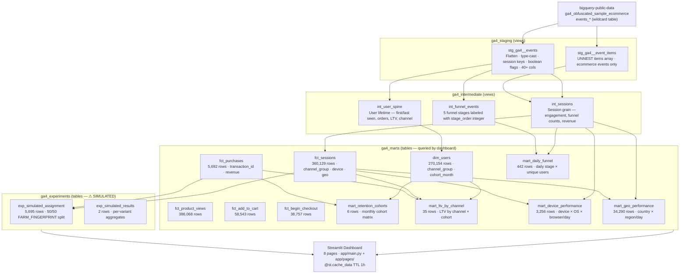

# Architecture

## Overview

This platform follows the **medallion architecture** pattern — raw source → staging views →
intermediate views → mart tables — deployed entirely in BigQuery with dbt Core orchestrating
all transformations. The Streamlit dashboard queries mart tables live via the Python BigQuery SDK.

---

## Mermaid Data Flow Diagram



---

## ASCII Diagram (plain-text fallback)

```
bigquery-public-data.ga4_obfuscated_sample_ecommerce.events_*
  │
  │  dbt reads cross-project via authorized views — zero data copy
  ▼
ga4_staging (views — your GCP project)
  ├── stg_ga4__events          Flatten, cast, surrogate keys, 40+ columns
  └── stg_ga4__event_items     UNNEST items[], ecommerce events only
       │
       ▼
ga4_intermediate (views — your GCP project)
  ├── int_sessions             Session grain: engagement, funnel counts, revenue
  ├── int_user_spine           User grain: lifetime totals, first-touch channel
  └── int_funnel_events        5 funnel stages, stage_order integer
       │
       ▼
ga4_marts (tables — your GCP project)
  ├── dim_users                270,154  User dimension + channel + cohort
  ├── fct_sessions             360,129  Session fact
  ├── fct_purchases              5,692  Purchase events
  ├── fct_product_views        386,068  view_item events
  ├── fct_add_to_cart           58,543  add_to_cart events
  ├── fct_begin_checkout        38,757  begin_checkout events
  ├── mart_daily_funnel            442  Daily stage × unique users
  ├── mart_retention_cohorts         6  Monthly cohort retention matrix
  ├── mart_ltv_by_channel           35  LTV by channel × cohort month
  ├── mart_device_performance    3,256  Device × OS × browser per day
  └── mart_geo_performance      34,290  Country × region per day
       │
       ├──────────────────────────────────────────────────────────────────┐
       ▼                                                                  ▼
ga4_experiments (tables — ⚠ SIMULATED)              Streamlit Dashboard
  ├── exp_simulated_assignment  5,695  Deterministic 50/50 hash split    app/main.py
  └── exp_simulated_results         2  Per-variant aggregates            + 8 pages
```

---

## Layer Design Principles

| Layer | Materialization | Purpose | Key Rule |
|---|---|---|---|
| Staging | `view` | 1:1 with source; extract, cast, add keys | No business logic; no aggregation |
| Intermediate | `view` | Business grain changes and joins | No mart-level aggregation |
| Marts | `table` | Query-ready aggregates consumed by dashboard | Optimized for read performance |
| Experiments | `table` | Simulated assignment + observed outcomes | Clearly labeled as synthetic |

---

## Key Technical Decisions

### No data copy in staging
Staging models are views that read directly from `bigquery-public-data`. Only mart
models materialize as tables. This means:
- Zero BigQuery storage cost for staging/intermediate
- Staging scans only when downstream models rebuild or a dashboard tab loads for the first time
- Mart tables absorb the scan cost once at build time; all dashboard queries read from them

### Date filtering via dbt vars
The `_TABLE_SUFFIX` filter in staging is parameterized:
```sql
where _table_suffix between
    replace('{{ var("start_date") }}', '-', '')
    and replace('{{ var("end_date") }}', '-', '')
```
This enables cheap incremental rebuilds and easy date-range testing:
```bash
dbt build --select staging --vars '{"start_date":"2021-01-01","end_date":"2021-01-07"}'
```

### Deterministic experiment assignment
Users are assigned to control/treatment without any stored state:
```sql
MOD(ABS(FARM_FINGERPRINT(user_pseudo_id || '_exp_checkout_v2_001')), 2)
-- 0 → control, 1 → treatment
-- Same user always gets same variant; reproducible across rebuilds
```

### ADC authentication — no key files
`dbt-bigquery` uses `method: oauth` and the Streamlit app uses `google.cloud.bigquery`
with Application Default Credentials. No service account key file is stored anywhere in the repo.

### Custom schema name macro
The standard dbt schema naming (`target_schema + '_' + custom_schema`) is overridden
so datasets are named cleanly (`ga4_staging`, not `product_analytics_dev_ga4_staging`):
```jinja

     {{ target.schema }}
     {{ custom_schema_name | trim }}
    

```

---

## BigQuery Datasets

| Dataset | Layer | Materialization | Access pattern |
|---|---|---|---|
| `ga4_staging` | Staging | Views | Only accessed by intermediate models during dbt build |
| `ga4_intermediate` | Intermediate | Views | Only accessed by mart models during dbt build |
| `ga4_marts` | Marts | Tables | Queried live by dashboard, read by experiment models |
| `ga4_experiments` | Experiments | Tables | Queried live by Experiment Demo dashboard page |

---

## What Is Real vs Simulated

| Component | Status | Notes |
|---|---|---|
| Raw GA4 events | **Real** | Public Google dataset; real user behavior (obfuscated) |
| All staging / intermediate models | **Real** | Exact transformations of real events |
| All mart models | **Real** | Aggregated real event data |
| Experiment assignment | **Simulated** | FARM_FINGERPRINT hash; no treatment was applied |
| Experiment outcomes | Real events / synthetic cohorts | Observed purchase data read on a synthetic split |
| Statistical tests | Real methodology | Standard z-test applied to synthetic cohorts |

---

## Data Quality Coverage

| Model group | Tests | Pass | Warn | Error |
|---|---|---|---|---|
| Staging | 29 | 27 | 2 | 0 |
| Intermediate | 20 | 20 | 0 | 0 |
| Marts | 62 | 62 | 0 | 0 |
| Experiments | 17 | 17 | 0 | 0 |
| **Total** | **128** | **126** | **2** | **0** |

The 2 warnings are expected GA4 data quality gaps:
- `accepted_values event_name` — 2 custom event names not in the standard taxonomy (harmless)
- `assert_purchase_has_transaction_id` — 23 purchase events with null transaction_id (known GA4 sample gap)

---

## Dashboard Architecture

```
app/
├── main.py                    Landing page — nav table, architecture summary
├── pages/
│   ├── 01_executive_overview.py   fct_sessions, fct_purchases, mart_ltv_by_channel
│   ├── 02_funnel.py               fct_* (5 tables for period funnel), mart_daily_funnel
│   ├── 03_retention.py            mart_retention_cohorts
│   ├── 04_ltv.py                  mart_ltv_by_channel
│   ├── 05_channel_device.py       fct_sessions, mart_device_performance
│   ├── 06_geography.py            mart_geo_performance
│   ├── 07_experiment_demo.py      exp_simulated_results, exp_simulated_assignment, fct_purchases
│   └── 08_data_quality.py         All 11 mart tables (COUNT queries)
└── utils/
    ├── bq_client.py               ADC client, run_query(), marts_table(), experiments_table()
    └── queries.py                 18 @st.cache_data(ttl=3600) query functions
```
